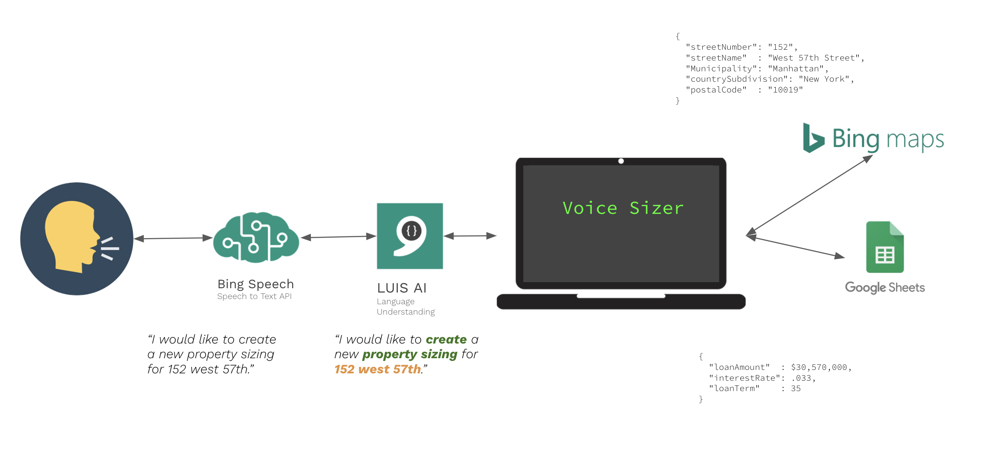

# Voice Sizer

A fun project where a user can get live HUD loan terms on a property with voice commands (or typed responses - works as a chatbot too). 

Uses Bing Speech API for vocals, Bing Maps for Address, and Microsoft's LUIS.ai for language understanding. Connects to Google Sheets for UW.

1. User vocalizes responses
2. Microsoft Cognitive Speech Recognition converts speech to text
3. LUIS AI pulls out key entities from speech text
4. Voice Sizer takes speech entities and routes to appropriate action
*(if new sizing)*
5. Voice Sizer sends spoken address to Bing Maps for address standardization (required for proper underwriting).
6. Voice Sizer combines standard address with user spoken values to send to Google Sheet Underwriting Model
7. Underwriting Model responds with loan terms. Voice Sizer speaks loan term results.
8. Profit!

## Install

`pip install requirements.txt`

PyAudio depends on another package, `portaudio`. If PyAudio fails to install, install `portaudio` with `brew install portaudio` first. Then rerun `pip installl pyaudio`.

You'll need the following env vars (which can be set in a .env file or set explicitly):

| Env Var        | Description |
| -------------- | ------------- |
| BING_MAPKEY    | Bing Maps used for address recognition. [Instructions on how to get a Bing Map Key](https://docs.microsoft.com/en-us/bingmaps/getting-started/bing-maps-dev-center-help/getting-a-bing-maps-key)  |
| BING_SPEECHKEY | Bing speech used for speech to text recognition. [Instructions on how to get a Bing Speech Key](https://docs.microsoft.com/en-us/azure/cognitive-services/speech-service/overview#try-the-speech-service-for-free)  |
| LUIS_APPID     | Microsoft LUIS is used for text entity recognition. For example, it can parse that you want to "create a sizing" from the following requests: "I would like to create a sizing" or "please create a sizing for me". [Instructions on how to get a LUIS App ID & App Key](https://docs.microsoft.com/en-us/azure/cognitive-services/speech-service/quickstarts/create-luis)  |
| LUIS_APPKEY    | See above  |
| GSHEET_SSKEY   | Google Sheets are used to run the property underwriting. The Sheet ID for the UW model is "1Y9VYZbQeUaRWYxCZlmtpuhcwpZqkbfn6wrbRq_UFNH4". Email for permissions to access! |

## Usage

Start the show with:

`python create_sizing.py`

First time run, google will open a browser window for OAuth to the google sheet

The following is an example sizing:

---

**Voice Sizer: Hello, how can I help you?**

*Hi, I would like to create a new property sizing.*

**VS: Got it, you would like to create a sizing.**

**VS: What is the address of the property?**

*152 West 57th street, New York, New York*

**VS: How much did the property collect in rent last year?**

*Three million five hundred twenty thousand dollars*

**VS: What were the total expenses for the property last year?**

*About one million eight hundred thousand*

**VS: How many units are available at the property?**

*There are two hundred and seventy five units available*

**VS: Thank you, sizing property now.**

`... Sizing property`

**VS: Finished with sizing, pulling FHA loan terms...**

**VS: We have a loan amount of thirty million five hundred and seventy thousand at a three point thirty rate for a thirty five year term.**

**VS: This sizing was completed in two point sixty-three seconds. Beat that Ryan Patterson!**

---

Note, Ryan Patterson was only slightly hurt by the presentation. He is still considered the rising star underwriter and is honored to be the benchmark.